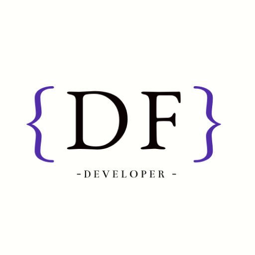

# Portfolio Personal ✨

  
  
 

## Sobre el Proyecto 

Portfolio personal desarrollado con React y TailwindCSS, diseñado para mostrar proyectos y habilidades de manera interactiva y moderna. Enfocado en la experiencia de usuario y el diseño minimalista.

## Características

`Diseño Responsive` • `Modo Oscuro/Claro` • `Animaciones Suaves` • `Navegación Fluida`

`Galería Interactiva` • `Sección CV` • `Componentes Reutilizables`

## Tecnologías 

#### Core

#### Herramientas

Desarrollado con ❤️ por Daiana Fernandez

