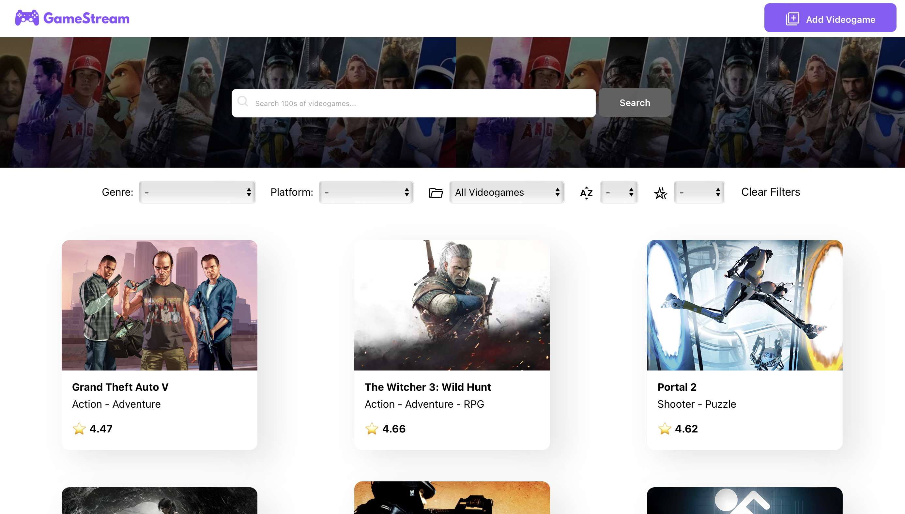
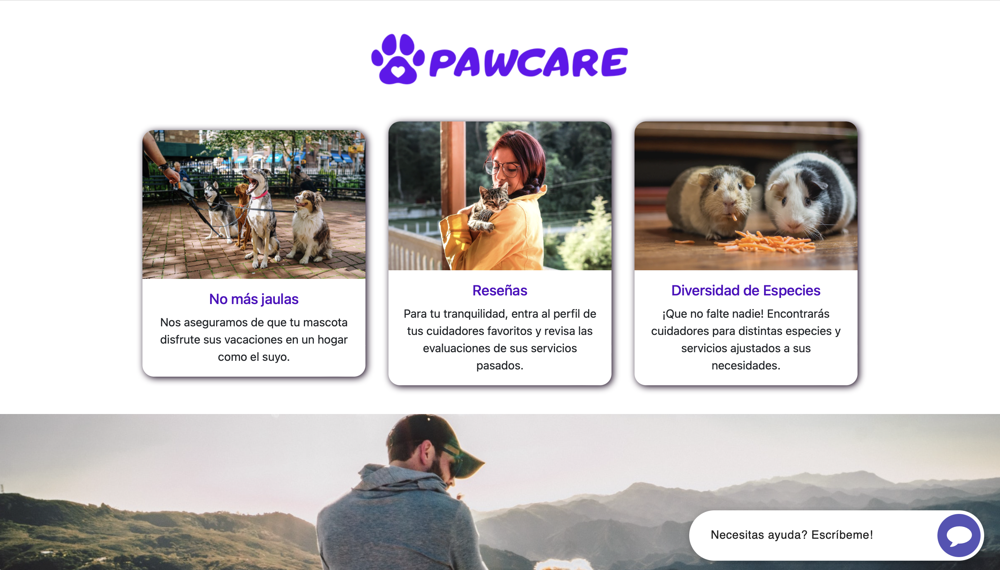

# Portfolio Personal ✨

  

---

  

  *Desarrollo web moderno y creativo*

## Sobre el Proyecto 🎯

Portfolio personal desarrollado con React y TailwindCSS, diseñado para mostrar proyectos y habilidades de manera interactiva y moderna. Enfocado en la experiencia de usuario y el diseño minimalista.

## Vista Previa 🖼️

  
  

## Características ⭐

`Diseño Responsive` • `Modo Oscuro/Claro` • `Animaciones Suaves` • `Navegación Fluida`

`Galería Interactiva` • `Sección CV` • `Componentes Reutilizables`

## Tecnologías 🛠️

#### Core

#### Stack

#### Herramientas

Desarrollado con ❤️ por Daiana Fernandez

